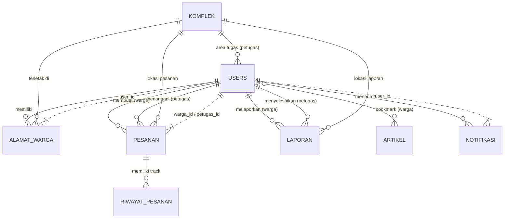

# Blueprint Arsitektur Database EcoTrash

Dokumen ini memuat rancangan skema basis data (_Database Schema_) untuk proyek EcoTrash, didasarkan pada dokumen kebutuhan (PRD) dan spesifikasi antarmuka Warga, Admin, serta Petugas.

---

## 1. Entity Relationship Diagram (ERD)

Berikut adalah visualisasi relasi antar entitas utama menggunakan sintaks Mermaid.

---

## 2. Spesifikasi Tabel dan Kolom

### 1. `users` (Tabel Induk Autentikasi Warga, Petugas, Admin)

Menyimpan semua akun pengguna dengan pemisahan akses menggunakan kolom `role`.

- `id` (Primary Key, BigInt)
- `nama` (String)
- `email` (String, Unique)
- `no_telepon` (String, Nullable) -> _Wajib diisi saat daftar warga, bisa diubah di pengaturan_
- `foto_profil` (String/URL, Nullable)
- `password` (String, Hashed)
- `role` (Enum: 'admin', 'warga', 'petugas')
- `saldo_koin` (Integer, Default: 0) -> _Hanya untuk warga_
- `status_kehadiran` (Enum: 'aktif', 'berhalangan') -> _Hanya untuk petugas_
- `alasan_berhalangan` (Text, Nullable) -> _Diisi jika petugas mengajukan status berhalangan_
- `created_at`, `updated_at` (Timestamp)

### 1a. `petugas_komplek` (Tabel Pivot Area Tugas)

Menyimpan relasi multi-area penugasan untuk role Petugas (1 Petugas bisa handle banyak komplek).

- `petugas_id` (Foreign Key -> `users.id`)
- `komplek_id` (Foreign Key -> `komplek.id`)
- `created_at` (Timestamp)

### 2. `komplek` (Master Data Komplek)

- `id` (Primary Key, BigInt)
- `nama_komplek` (String)
- `lat` (Decimal) -> _Koordinat Peta_
- `lng` (Decimal) -> _Koordinat Peta_
- `created_at`, `updated_at` (Timestamp)

### 3. `alamat_warga`

Satu warga bisa memiliki lebih dari satu alamat tersimpan.

- `id` (Primary Key, BigInt)
- `warga_id` (Foreign Key -> `users.id`)
- `komplek_id` (Foreign Key -> `komplek.id`)
- `nama_alamat` (String) -> _Cth: Rumah, Kantor_
- `blok_nomor_rumah` (String) -> _Alamat lengkap_
- `detail_patokan` (Text, Nullable) -> _Cth: Pagar Hitam, Depan Warung_
- `is_utama` (Boolean, Default: false)
- `created_at`, `updated_at` (Timestamp)

### 4. `pengaturan_sistem`

Tabel _single-row_ atau _key-value_ untuk menyimpan konfigurasi dari Admin.

- `id` (Primary Key, BigInt)
- `konversi_koin_rupiah` (Integer) -> _Berapa Rp untuk 1 koin_
- `harga_kategori_kecil` (Integer)
- `harga_kategori_sedang` (Integer)
- `harga_kategori_besar` (Integer)
- `bonus_koin_kecil` (Integer)
- `bonus_koin_sedang` (Integer)
- `bonus_koin_besar` (Integer)
- `batas_waktu_pesan` (Time) -> _Cut-off time pesanan harian_
- `kuota_pesanan_harian` (Integer)
- `hari_operasional` (JSON) -> _Contoh: ["Senin", "Selasa", "Kamis"]_
- `created_at`, `updated_at` (Timestamp)

### 5. `pesanan_pengangkutan`

Tabel transaksi utama untuk layanan angkut sampah.

- `id` (Primary Key, UUID/String) -> _Bisa diformat sebagai resi, misal: INV-1234_
- `warga_id` (Foreign Key -> `users.id`)
- `komplek_id` (Foreign Key -> `komplek.id`)
- `nama_alamat_snapshot` (String) -> _Snapshot nama alamat (cth: Rumah Utama)_
- `blok_nomor_rumah` (String) -> _Snapshotted saat pesan, berjaga-jaga jika alamat warga dihapus_
- `detail_patokan_snapshot` (Text, Nullable) -> _Snapshot patokan alamat_
- `kategori_sampah` (Enum: 'kecil', 'sedang', 'besar')
- `tanggal_penjemputan` (Date)
- `nama_hari_penjemputan` (String)
- `catatan_warga` (Text, Nullable)
- `koin_digunakan` (Integer, Default: 0)
- `koin_didapat` (Integer, Default: 0) -> _Koin reward setelah selesai_
- `harga_awal` (Integer) -> _Harga saat pesanan dibuat_
- `total_harga_akhir` (Integer) -> _Harga setelah perubahan ukuran_
- `selisih_harga` (Integer, Default: 0) -> _Beda harga awal dan akhir_
- `status` (Enum: 'menunggu_pembayaran', 'menunggu_pembayaran_selisih', 'menunggu', 'diproses', 'selesai', 'dibatalkan', 'hold_kapasitas', 'gagal_pickup')
- `status_pembayaran` (Enum: 'unpaid', 'paid', 'failed')
- `metode_pembayaran` (Enum: 'qris', 'transfer_bank')
- `payment_reference` (String, Nullable) -> _Menyimpan ID transaksi dari Payment Gateway (misal QRIS)_
- `petugas_id` (Foreign Key -> `users.id`, Nullable) -> _Di-assign oleh admin setelah paid_
- `ukuran_aktual_laporan_petugas` (Enum: 'sedang', 'besar', Nullable) -> _Terisi jika ada kasus beda ukuran_
- `alasan_kendala` (Text, Nullable) -> _Catatan saat petugas menemui kendala (cth: pagar tertutup)_
- `foto_kendala` (String/URL, Nullable) -> _Foto bukti kendala_
- `foto_bukti_selesai` (String/URL, Nullable)
- `created_at`, `updated_at` (Timestamp)

### 6. `laporan_sampah_liar`

Tabel untuk penanganan sampah ilegal.

- `id` (Primary Key, BigInt)
- `warga_id` (Foreign Key -> `users.id`)
- `komplek_id` (Foreign Key -> `komplek.id`, Nullable) -> _Diisi otomatis oleh backend berdasarkan koordinat terdekat dari komplek terdaftar_
- `lat` (Decimal)
- `lng` (Decimal)
- `alamat_lokasi` (String, Nullable) -> _Teks alamat hasil konversi Reverse Geocoding_
- `deskripsi` (Text)
- `foto_laporan_warga` (String/URL)
- `status` (Enum: 'menunggu', 'disetujui', 'ditolak', 'sedang_dibersihkan', 'selesai')
- `koin_reward` (Integer, Default: 0) -> _Koin yang diberikan admin jika disetujui_
- `petugas_id` (Foreign Key -> `users.id`, Nullable) -> _Petugas yang menangani_
- `foto_bukti_selesai_petugas` (String/URL, Nullable)
- `created_at`, `updated_at` (Timestamp)

### 7. `artikel_edukasi`

- `id` (Primary Key, BigInt)
- `judul` (String)
- `kategori` (String)
- `gambar_thumbnail` (String/URL)
- `konten_html` (LongText)
- `penulis_admin_id` (Foreign Key -> `users.id`)
- `created_at`, `updated_at` (Timestamp)

### 8. `bookmark_artikel` (Tabel Pivot)

- `warga_id` (Foreign Key -> `users.id`)
- `artikel_id` (Foreign Key -> `artikel_edukasi.id`)
- `created_at` (Timestamp)

### 9. `notifikasi`

Tabel untuk menyimpan notifikasi persisten yang muncul di panel bel/lonceng Warga maupun Admin.

- `id` (Primary Key, BigInt)
- `user_id` (Foreign Key -> `users.id`)
- `reference_id` (BigInt, Nullable) -> _ID entitas terkait (misal ID pesanan atau laporan)_
- `reference_type` (String, Nullable) -> _Tipe referensi (misal: 'pesanan', 'laporan')_
- `judul` (String)
- `pesan` (Text)
- `tipe` (Enum: 'info', 'warning', 'success', 'error')
- `is_read` (Boolean, Default: false)
- `created_at` (Timestamp)

### 10. `riwayat_status_pesanan`

Tabel untuk merekam audit trail atau rekam jejak status pesanan pengangkutan, digunakan untuk fitur modal pelacakan/tracking waktu real-time.

- `id` (Primary Key, BigInt)
- `pesanan_id` (Foreign Key -> `pesanan_pengangkutan.id`)
- `status` (Enum: 'menunggu_pembayaran', 'menunggu_pembayaran_selisih', 'menunggu', 'diproses', 'selesai', 'dibatalkan', 'hold_kapasitas', 'gagal_pickup')
- `keterangan` (Text, Nullable) -> _Pesan tambahan (cth: "Pesanan telah dikonfirmasi dan menunggu penugasan petugas")_
- `created_at` (Timestamp)
