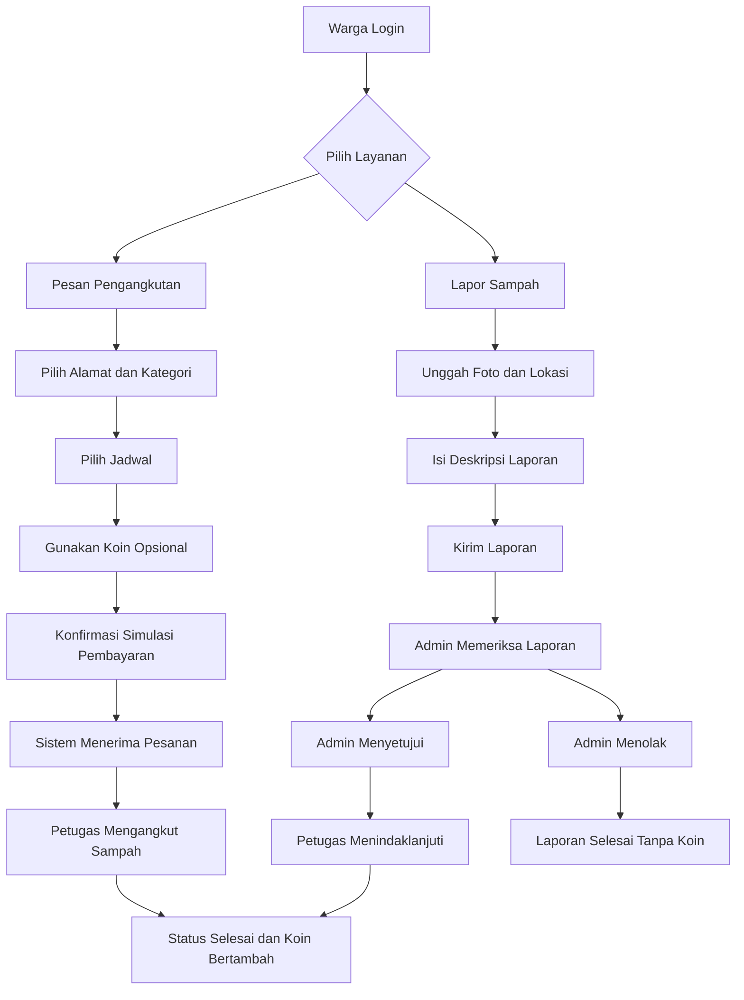
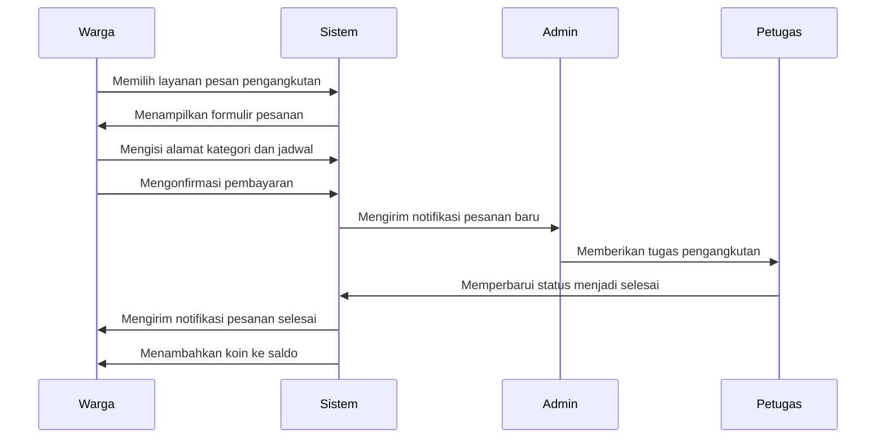
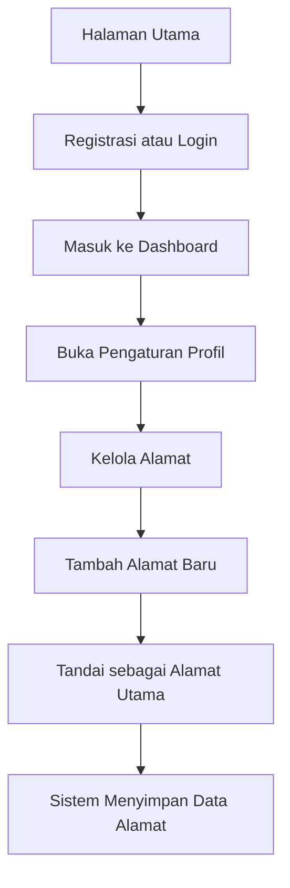
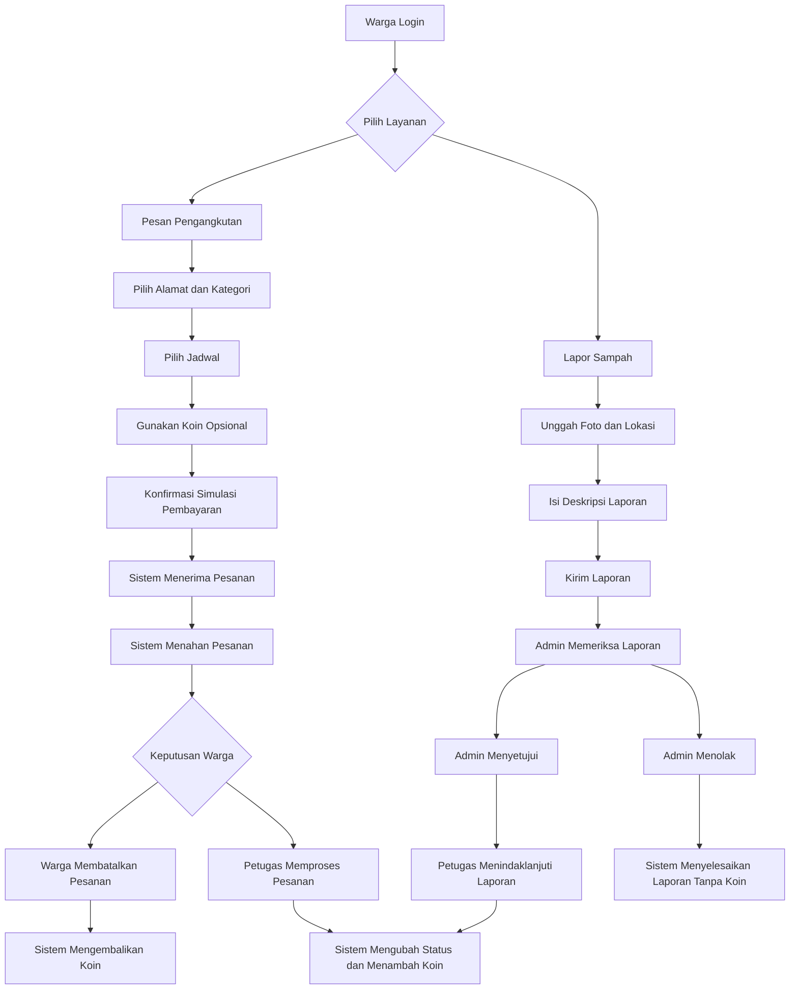
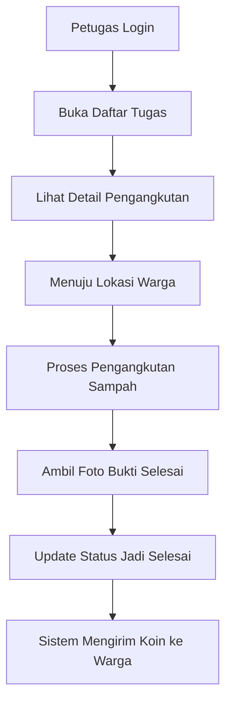
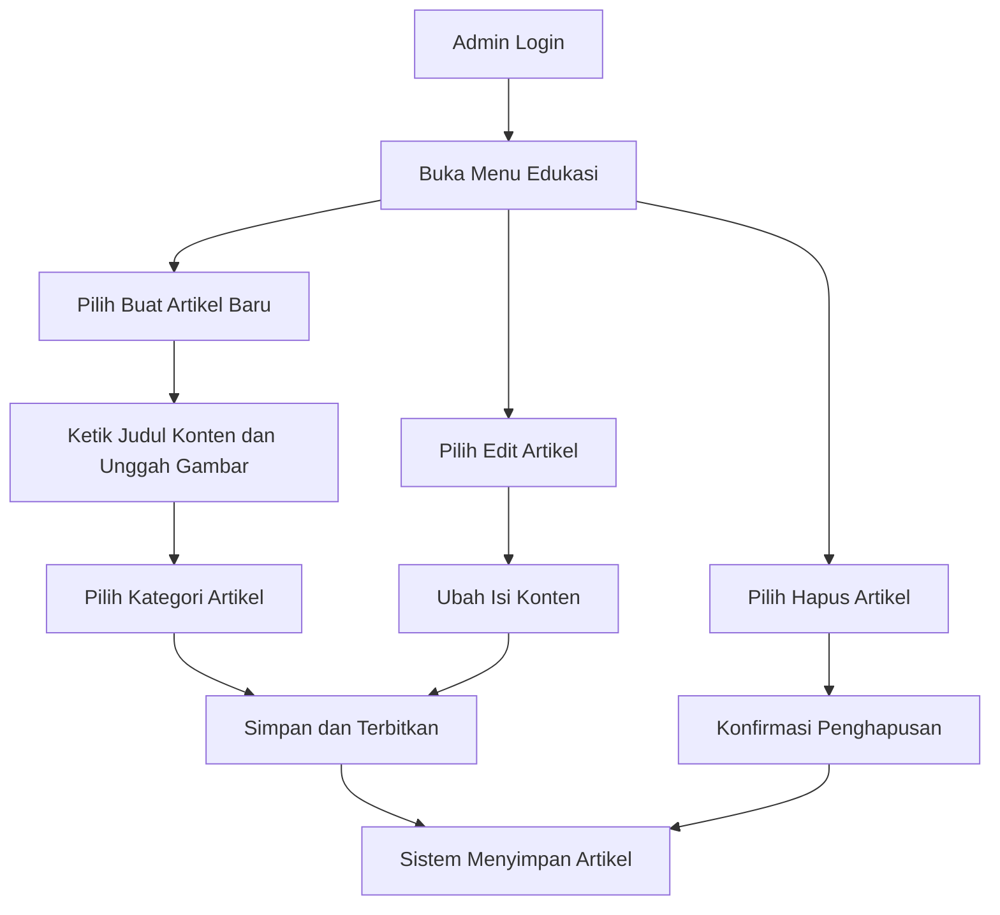
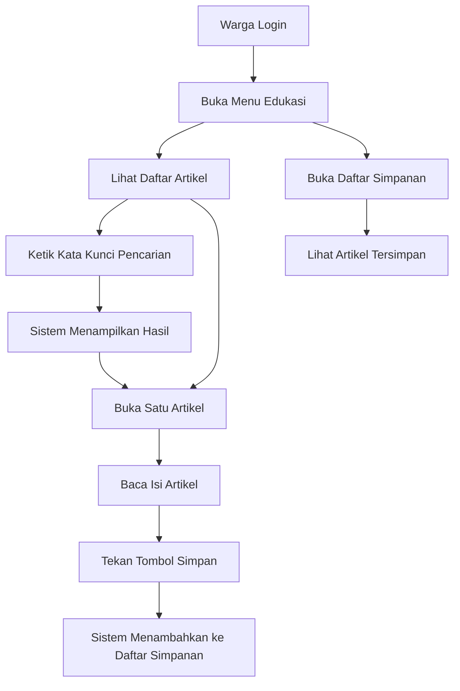
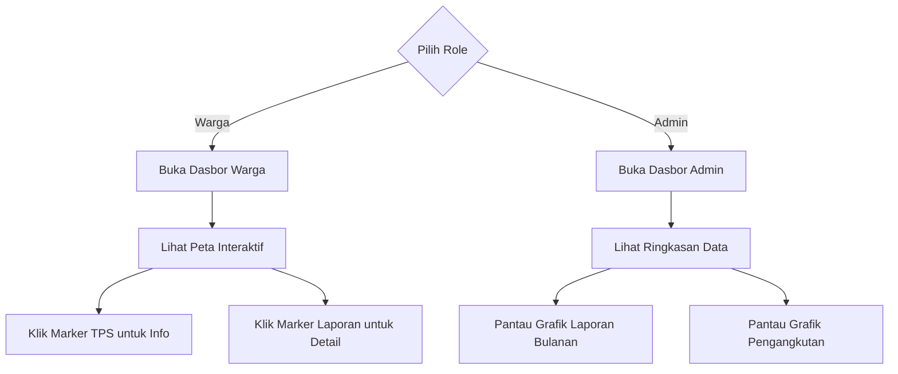

## PRODUCT REQUIREMENT DOCUMENT (PRD)

**EcoTrash — Sistem Pengelolaan Sampah Berbasis Komplek**

---

### 1. Deskripsi Produk

EcoTrash adalah aplikasi web (Web-Based) berbasis Laravel yang dirancang dengan antarmuka responsif agar fleksibel digunakan baik di perangkat desktop maupun seluler (Mobile-Friendly). Aplikasi ini memfasilitasi pemesanan jadwal pengangkutan sampah, pelaporan tumpukan sampah liar, operasional petugas lapangan, dan pengawasan berbasis data oleh admin. Sistem ini menggunakan fitur peta interaktif dan memberikan penghargaan koin untuk meningkatkan partisipasi aktif warga.

### 2. Tujuan Produk

- Mempermudah proses pengangkutan sampah rumah tangga.
- Mengurangi keberadaan sampah liar di area perumahan.
- Mendorong partisipasi aktif warga melalui sistem penghargaan koin.
- Menyediakan data operasional melalui dasbor informatif untuk evaluasi berkelanjutan.

### 3. Peran Pengguna

- **Warga:** Memesan jadwal pengangkutan, melaporkan sampah liar, membaca artikel edukasi, melihat dasbor publik, dan menggunakan koin.
- **Petugas:** Memeriksa daftar tugas, melakukan pengambilan sampah, dan memperbarui status penyelesaian di lapangan.
- **Admin:** Mengelola data warga, membuat dan mengelola akun petugas, memverifikasi laporan, mengatur ketersediaan hari jadwal operasional (termasuk kuota dan batas waktu pemesanan), mengatur harga layanan dan nilai konversi koin, menugaskan petugas lapangan, mengelola artikel edukasi, dan memantau analitik dasbor.

### 4. Fitur Utama dan Alur Kerja

Berikut adalah diagram alir proses utama dan urutan interaksi antar pengguna di dalam sistem EcoTrash.

#### 4.1 Manajemen Profil dan Alamat

- Registrasi akun Warga dapat dilakukan secara bebas oleh siapa saja.
- Akun Admin di-*seeding* langsung ke dalam basis data. Untuk akun Petugas, Admin membuatnya secara manual melalui menu "Mengelola akun petugas" di dasbor Admin.
- Saat melengkapi pengaturan profil, Warga diminta untuk mengatur alamat. Sistem akan menampilkan *dropdown* daftar komplek perumahan yang tersedia (data komplek ini dikelola oleh Admin). Warga memilih salah satu komplek dan mengetikkan teks detail nomor rumah atau blok. Alamat ini berbasis teks saja dan tidak menggunakan penyematan titik koordinat. Warga menetapkan satu alamat utama (default) dan bisa menambahkan alamat sekunder.

#### 4.2 Pemesanan Pengangkutan Sampah (Fitur Inti)

- Warga memilih alamat pengangkutan (berdasarkan daftar alamat di profil) dan menentukan kategori ukuran sampah (Kecil, Sedang, Besar). Harga dasar untuk setiap kategori diatur secara dinamis oleh Admin melalui dasbor.
- Warga memilih hari pengangkutan. Admin memiliki fitur di dasbor untuk mengatur ketersediaan hari pemesanan, waktu batas pemesanan (*cut-off time*), serta mengatur kuota maksimal pesanan per harinya.
- Warga menambahkan catatan opsional untuk petugas lapangan.
- Warga mengonfirmasi tagihan dan memilih opsi penggunaan koin. Sistem memproses simulasi pembayaran menjadi Lunas tanpa terhubung gerbang pembayaran pihak ketiga.
- Sistem menerbitkan kode resi unik digital berisi detail pesanan dan jadwal.
- Status pesanan berjalan secara berurutan: Menunggu, Diproses, Selesai.

**Penanganan Kasus Khusus Pengangkutan:**

- **Pembatalan Warga:** Warga membatalkan pesanan maksimal satu jam sebelum jadwal pengangkutan. Sistem membatalkan tugas petugas dan mengembalikan koin terpakai ke saldo warga.
- **Kapasitas Berbeda:** Warga memesan kategori kecil, tetapi aktual tumpukan berukuran besar. Petugas memotret perbedaan tersebut dan sistem meminta konfirmasi penyesuaian biaya kepada warga. Sistem membatalkan pesanan jika warga menolak penyesuaian.

#### 4.3 Operasional Petugas Lapangan

- Petugas masuk ke sistem dan melihat rincian lokasi warga pada daftar tugas.
- Petugas menuju lokasi dan memproses pengangkutan.
- Petugas memotret tumpukan sampah sebagai bukti dan memperbarui status aplikasi menjadi selesai.

**Penanganan Kasus Khusus Petugas:**

- **Lokasi Tertutup:** Petugas tiba di lokasi pengangkutan tetapi pagar terkunci. Petugas menunggu 10 menit. Jika warga tidak merespons, petugas menetapkan status gagal. Warga membuat pesanan baru untuk hari berikutnya.
- **Petugas Berhalangan:** Petugas sakit atau kendaraan rusak. Sistem memberi peringatan kepada admin. Admin mengalihkan tugas ke petugas lain dan sistem mengirim notifikasi keterlambatan kepada warga.

#### 4.4 Pelaporan Sampah Liar

- Warga membuat laporan dengan menyematkan titik lokasi peta, mengunggah foto, dan mengisi deskripsi tumpukan sampah liar.
- Admin menyetujui atau menolak laporan.
- Admin menugaskan petugas untuk menindaklanjuti laporan yang disetujui. Petugas membersihkan area dan memperbarui status aplikasi.

**Penanganan Kasus Khusus Pelaporan:**

- **Laporan Ganda:** Warga berbeda melaporkan tumpukan sampah liar yang sama. Admin menyatukan laporan menjadi satu tiket penugasan. Sistem mengirim koin hanya kepada pelapor pertama dan mengirim pemberitahuan status penanganan kepada pelapor lainnya.

#### 4.5 Sistem Koin (Penghargaan dan Pemotongan)

- **Nilai Tukar:** Admin memiliki fitur di dasbor untuk mengatur sendiri berapa nilai konversi tiap koin ke nilai uang (contoh *default*: 1 koin = Rp100).
- **Distribusi Pengangkutan:** Sistem memberikan koin secara otomatis (jumlah diatur sistem/admin) ketika petugas menyelesaikan pesanan pengangkutan.
- **Distribusi Pelaporan:** Sistem memberikan koin (jumlah diatur sistem/admin) setelah admin memvalidasi kebenaran laporan sampah liar. Margin nilai dirancang lebih rendah dari pengangkutan untuk menjaga kesehatan arus kas operasional.
- **Batas Maksimal Penggunaan:** Warga memakai koin sebagai potongan biaya dengan batas maksimal 50 persen dari total tagihan transaksi.
- **Masa Berlaku:** Saldo koin hangus secara otomatis dalam jangka waktu 6 bulan sejak transaksi terakhir warga.

#### 4.6 Edukasi Lingkungan

- Admin memegang kendali penuh untuk membuat judul, mengunggah gambar pendukung, menentukan kategori, menerbitkan, atau menghapus artikel edukasi.
- Warga membaca daftar artikel, mengetik kata kunci pencarian, dan menekan tombol simpan untuk menyematkan artikel ke daftar bacaan pribadi.

#### 4.7 Dasbor dan Peta Interaktif

- **Dasbor Warga:** Menyediakan antarmuka peta visual berisi titik penanda lokasi TPS dan titik tumpukan laporan sampah liar.
- **Dasbor Admin:** Menyajikan ringkasan data menyeluruh, grafik fluktuasi laporan bulanan, dan analitik frekuensi pengangkutan.

#### 4.8 Notifikasi

Sistem memancarkan peringatan waktu nyata terkait rincian pesanan baru, pembaruan status laporan, dan aktivitas operasional petugas di lapangan.

### 5. Spesifikasi Teknis (Tech Stack)

- **Frontend:** Laravel Blade, Alpine.js, Tailwind CSS, Axios, Leaflet.js (OpenStreetMap).
- **Backend:** Laravel, Laravel Breeze/Jetstream (Autentikasi), Laravel Reverb atau Pusher (untuk fitur *WebSockets* / Notifikasi Waktu Nyata).
- **Basis Data:** MySQL.
- **Visualisasi Dasbor:** Chart.js atau Recharts.
- **Manajemen Proyek:** GitHub dan Jira.
- **Rencana Implementasi:** Aplikasi disebarkan pada basis Laravel menggunakan domain `ecotrash.laravel.app`.

### 6. Arsitektur Sistem

Komponen Frontend dirender menggunakan Blade Template yang didukung oleh Alpine.js untuk interaktivitas ringan. *Routing* dan *Controller* dikelola sepenuhnya oleh Laravel di sisi Backend, yang kemudian berinteraksi langsung dengan pangkalan data MySQL. Arsitektur ini memastikan performa yang cepat dan kemudahan dalam pengembangan sebagaimana role Admin yang sudah ada.

### 7. Kriteria Non-Fungsional

- **Desain Responsif:** Antarmuka aplikasi harus fleksibel dan optimal saat diakses melalui peramban (browser) di berbagai ukuran layar, mulai dari desktop, tablet, hingga perangkat seluler (Mobile-First approach).
- **Navigasi Intuitif:** Tata letak menu dan elemen UI dirancang sederhana untuk memudahkan adopsi pengguna dari berbagai kalangan usia.
- **Performa:** Proses pengambilan dan pengiriman data berjalan cepat untuk menjamin kenyamanan pengguna di lapangan.
- **Skalabilitas & Stabilitas:** Infrastruktur basis data memadai dan stabil untuk volume lalu lintas berskala satu komplek perumahan.

### 8. Batasan Lingkup Sistem

- Fungsionalitas aplikasi dibatasi secara eksklusif untuk warga satu komplek perumahan.
- Sistem belum memiliki kapabilitas optimasi algoritma rute pengangkutan petugas.
- Fitur pembayaran berjalan sebatas simulasi pencatatan internal tanpa modul integrasi pihak ketiga.

### 9. Indikator Keberhasilan Bisnis

- Peningkatan akumulasi jumlah transaksi pengangkutan per bulan.
- Peningkatan tingkat penyelesaian pelaporan sampah liar.
- Peningkatan retensi harian aktivitas pelaporan warga.
- Perputaran sirkulasi distribusi dan penggunaan koin yang stabil.

---
