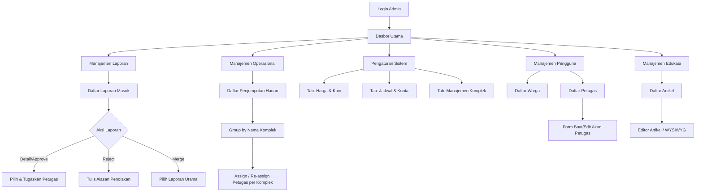

# UI/UX Brief & Konteks: Role Admin EcoTrash

Dokumen ini memuat panduan, konteks, dan struktur informasi untuk merancang antarmuka (UI) dan pengalaman pengguna (UX) khusus bagi **Role Admin** pada aplikasi web EcoTrash. Brief ini disusun berdasarkan Product Requirement Document (PRD) EcoTrash.

## 1. Ikhtisar Peran Admin
Admin adalah pengendali utama operasional di EcoTrash. Jika *Warga* adalah konsumen layanan dan *Petugas* adalah eksekutor di lapangan, maka *Admin* adalah **Pusat Komando (Command Center)**. Admin bertanggung jawab memastikan kelancaran alur pemesanan, mengawasi laporan warga, mengatur kebijakan harga dan kuota, serta memantau kesehatan ekosistem (termasuk arus koin).

**Tujuan UX Admin:**
- **Efisiensi & Kecepatan:** Memudahkan admin mengambil keputusan cepat (misal: menyetujui laporan, menugaskan ulang petugas).
- **Visibilitas Data Tinggi:** Dasbor harus menyajikan ringkasan data yang kompleks menjadi grafik dan angka yang mudah dicerna sekilas.
- **Kendali Terpusat:** Pengaturan operasional (harga, kuota, akun) harus mudah diakses tanpa alur navigasi yang berbelit.

---

## 2. Struktur Menu (Information Architecture)

Untuk mengakomodasi semua tanggung jawab Admin, navigasi (biasanya berupa *Sidebar* di Desktop dan *Hamburger Menu* di Mobile) harus dibagi menjadi modul-modul berikut:

### A. Dasbor (Overview)
- **Ringkasan Metrik Utama:** Total warga terdaftar, total pesanan hari ini, laporan sampah liar menunggu verifikasi, total koin beredar.
- **Peta Interaktif (Live Map):** Visualisasi titik lokasi penjemputan (TPS) dan titik laporan sampah liar secara *real-time*.
- **Grafik Analitik:** 
  - Grafik batang/garis frekuensi pengangkutan bulanan/harian.
  - Grafik fluktuasi laporan sampah liar.

### B. Manajemen Laporan Sampah Liar
- **Daftar Laporan Masuk:** Tabel (DataGrid) berisi laporan dari warga (Foto, Lokasi, Deskripsi, Pelapor, Waktu).
- **Aksi Verifikasi:** Tombol *Approve* (Setujui) dan *Reject* (Tolak). Saat menyetujui, admin langsung diarahkan ke *form* penugasan petugas lapangan.
- **Fitur Penggabungan (Merge):** UX untuk menggabungkan dua atau lebih laporan ganda di lokasi yang sama menjadi satu tiket tugas (koin hanya untuk pelapor pertama).

### C. Manajemen Operasional (Penjemputan)
- **Daftar Pesanan Warga:** Pantauan status (Menunggu, Diproses, Selesai, Dibatalkan).
- **Penugasan Darurat:** Antarmuka untuk mengalihkan tugas ke petugas lain jika petugas utama berhalangan.

### D. Pengaturan Sistem (Settings & Policies)
- **Pengaturan Harga & Koin:** Input dinamis untuk harga dasar sampah (Kecil, Sedang, Besar) dan nilai konversi koin (misal: 1 Koin = Rp100).
- **Pengaturan Jadwal & Kuota:** Kalender ketersediaan hari, batas waktu pemesanan (*cut-off time*), dan kuota pesanan harian.
- **Manajemen Komplek:** Tambah/Edit/Hapus daftar komplek perumahan yang muncul di *dropdown* warga.

### E. Manajemen Pengguna (Users)
- **Data Warga:** Tabel daftar warga (hanya lihat profil dan saldo koin, tidak bisa diedit karena registrasi bebas).
- **Akun Petugas:** Fitur CRUD (Create, Read, Update, Delete) akun petugas secara manual oleh admin.

### F. Manajemen Edukasi (CMS Artikel)
- **Daftar Artikel:** Tabel artikel (Diterbitkan, Draf).
- **Editor Artikel (WYSIWYG):** Form untuk ketik Judul, unggah *Thumbnail*, isi teks, pilih Kategori, dan tombol Terbitkan/Hapus.

---

## 3. Interaksi Utama & Penanganan Kasus Khusus (Edge Cases)

Desain UI/UX Admin harus mengantisipasi skenario spesifik berikut sesuai PRD:

1. **Laporan Ganda:** Jika ada indikasi tumpukan sampah yang sama dilaporkan warga berbeda, UI harus menonjolkan fitur "Tandai sebagai Duplikat / Gabungkan" untuk menghindari penugasan petugas berkali-kali ke titik yang sama.
2. **Pengalihan Tugas (Re-assignment):** Jika ada peringatan sistem bahwa petugas berhalangan (sakit/kendaraan rusak), dasbor harus memunculkan *Alert/Banner* darurat. Admin bisa mengklik peringatan tersebut untuk memunculkan *modal/popup* "Pilih Petugas Pengganti".
3. **Notifikasi Real-Time:** Admin harus memiliki panel notifikasi (ikon lonceng) yang terus diperbarui (*WebSockets/Pusher*) setiap ada pesanan baru, laporan baru, atau aktivitas petugas selesai.

---

## 4. Arahan Desain Visual (UI Guidelines)

Sesuai dengan pedoman visual umum EcoTrash:

- **Pendekatan Layout:** Karena Admin mengelola banyak data tabel dan form panjang, desain disarankan menggunakan pola **Dashboard Desktop-First**, dengan sidebar navigasi di kiri dan area konten luas di kanan. Namun, layout tetap harus bisa *collapse* (responsif) jika diakses melalui tablet/mobile.
- **Warna Tema:** 
  - **Primer:** Hijau Daun (Emerald/Forest Green) untuk elemen utama.
  - **Netral/Latar:** Putih dan Abu-abu Muda (Light Gray) agar teks dan data tabel sangat mudah dibaca.
  - **Aksen Status:** Kuning (Menunggu), Hijau Terang (Selesai/Approve), Merah (Batal/Reject/Peringatan Darurat).
  - **Aksen Khusus:** Emas/Kuning untuk ikon atau nilai Koin.
- **Tipografi:** *Font sans-serif* modern (Inter, Roboto) dengan hierarki bobot (*weight*) yang jelas antara Judul Metrik, Header Tabel, dan Isi Tabel.
- **Elemen UI Peta:** Peta interaktif (Leaflet.js) harus menempati porsi yang cukup besar di dasbor utama agar admin langsung mengenali distribusi operasional hari itu.

---

## 5. Ringkasan Kebutuhan Komponen Frontend (React/Inertia)
Untuk *developer/agent*, berikut adalah komponen UI umum yang akan sering direusable di *view* Admin:
- **Stat Cards:** Untuk menampilkan ringkasan metrik.
- **Data Tables (dengan Pagination & Search):** Untuk daftar laporan, pesanan, artikel, dan pengguna.
- **Modals / Slide-overs:** Untuk aksi cepat seperti "Detail Laporan", "Ubah Harga", atau "Tugaskan Petugas" tanpa harus pindah halaman penuh.
- **Rich Text Editor:** Untuk pembuatan konten Edukasi.
- **Map Component:** *Wrapper* Leaflet.js dengan fitur penambahan *marker* kustom.

---

## 6. Flowchart Alur Screen Role Admin

Diagram di bawah ini menggambarkan alur navigasi (*Screen Flow*) yang bisa diakses oleh Admin.



---

## 7. Gambaran Screen (ASCII) & Struktur Data

Berikut adalah gambaran kasar tata letak (*wireframe*) menggunakan teks ASCII dan struktur data yang akan ditampilkan pada setiap layarnya.

### A. Layar Dasbor Utama (Overview)

**Gambaran ASCII:**
```text
+-------------------------------------------------------------+
| [LOGO] | Pencarian Global...                 [🔔] [Admin] ⌄ |
+--------+----------------------------------------------------+
| 🏠 Dash| [Warga: 120]  [Pesanan: 45]  [Lapor: 12]  [Koin: 5k] |
| 📋 Lapor|                                                    |
| 🚛 Oper | +------------------------------------------------+ |
| ⚙️ Set  | |                                                | |
| 👥 User | |                PETA INTERAKTIF                 | |
| 📚 Edu  | |          (Marker Laporan & Titik TPS)          | |
|        | |                                                | |
|        | +------------------------------------------------+ |
|        | [  Grafik Pesanan 📊  ]   [  Grafik Laporan 📉  ]  |
+-------------------------------------------------------------+
```

**Struktur Data:**
- **Stat Cards:** `total_warga` (Int), `pesanan_hari_ini` (Int), `laporan_pending` (Int), `koin_beredar` (Int).
- **Peta Interaktif:** Array objek marker berisi `latitude` (Float), `longitude` (Float), `tipe` (Enum: TPS/Liar), `status` (String).
- **Grafik:** Data *time-series* untuk pesanan (X: Bulan, Y: Jumlah Selesai) dan laporan (X: Bulan, Y: Jumlah Laporan).

### B. Layar Manajemen Laporan Sampah Liar

**Gambaran ASCII:**
```text
+-------------------------------------------------------------+
| 📋 Laporan Sampah Liar           [ Filter Status ⌄ ] [ Cari ]|
+--------+----------------------------------------------------+
| 🏠 Dash| ID Lapor | Tanggal | Pelapor | Foto | Status | Aksi|
| 📋 Lapor|----------------------------------------------------|
| 🚛 Oper | #LP-01   | 10/Mei  | Budi    | [IMG]| Pending| [🔍]|
| ⚙️ Set  | #LP-02   | 11/Mei  | Siti    | [IMG]| Setuju | [🔍]|
| 👥 User | #LP-03   | 11/Mei  | Joko    | [IMG]| Ditolak| [🔍]|
| 📚 Edu  |----------------------------------------------------|
|        | < Prev  [1] [2] [3]  Next >                        |
+-------------------------------------------------------------+
```
*(Catatan: Menekan tombol 🔍 akan membuka Pop-up/Modal detail untuk menyetujui, menolak, atau menugaskan petugas).*

**Struktur Data (DataGrid Laporan):**
- `id_laporan` (String/Primary Key)
- `tanggal_dibuat` (DateTime)
- `nama_pelapor` (String)
- `titik_lokasi` (String/Alamat Deskriptif)
- `foto_bukti` (URL String)
- `status` (Enum: Pending, Approved, Rejected, Completed)
- **Aksi:** Detail, Approve/Tugaskan, Reject, Tandai Duplikat (Merge).

### C. Layar Manajemen Operasional (Penjemputan)

**Gambaran ASCII:**
```text
+-------------------------------------------------------------+
| 🚛 Penjemputan Harian              [ Tanggal 📅 ] [ Cari ]  |
+--------+----------------------------------------------------+
| 🏠 Dash| -------------------------------------------------- |
| 📋 Lapor| 📌 Komplek Bunga Asri                               |
| 🚛 Oper | Petugas Ditugaskan: [ Jajang, Asep ]      [ Ubah ]|
| ⚙️ Set  |----------------------------------------------------|
| 👥 User | Resi    | Pemesan | Kategori| Status     | Aksi  |
| 📚 Edu  | #TRX-98 | Budi    | Kecil   | ✅ Selesai | [🔍]  |
|        | #TRX-99 | Tono    | Besar   | ⏳ Proses  | [🔍]  |
|        |                                                    |
|        | -------------------------------------------------- |
|        | 📌 Komplek Cemara Indah                            |
|        | Petugas Ditugaskan: [ Belum Ada ]         [ Atur ]|
|        |----------------------------------------------------|
|        | Resi    | Pemesan | Kategori| Status     | Aksi  |
|        | #TRX-97 | Rina    | Sedang  | ⏳ Menunggu| [🔍]  |
+-------------------------------------------------------------+
```

**Struktur Data (Data Grouping Operasional):**
- **Level Grup (Komplek):**
  - `nama_komplek` (String)
  - `petugas_ditugaskan` (Array of Strings/Users) - *Admin memilih 1 atau 2 petugas per komplek dari dropdown/modal di sini.*
- **Level Detail (Pesanan Warga di dalam grup komplek):**
  - `kode_resi` (String)
  - `nama_pemesan` (String)
  - `kategori_sampah` (Enum: Kecil, Sedang, Besar)
  - `status_pesanan` (Enum: Menunggu, Diproses, Selesai, Batal)
  - **Aksi:** Lihat Detail Pesanan (Catatan warga, alamat spesifik/blok).

### D. Layar Pengaturan Sistem

Layar ini memiliki 3 sub-tab menu navigasi di bagian atas tabel.

**1. Tab Harga & Koin**
```text
+-------------------------------------------------------------+
| ⚙️ Pengaturan Sistem                                        |
+--------+----------------------------------------------------+
| 🏠 Dash| [ Harga & Koin ]  [ Jadwal & Kuota ]  [ Komplek ]  |
| 📋 Lapor|----------------------------------------------------|
| 🚛 Oper | Nilai Tukar Koin                                   |
| ⚙️ Set  | 1 Koin = [ Rp 100      ]                           |
| 👥 User |                                                    |
| 📚 Edu  | Harga Dasar Layanan                                |
|        | Kecil  = [ Rp 10.000   ]                           |
|        | Sedang = [ Rp 20.000   ]                           |
|        | Besar  = [ Rp 35.000   ]                           |
|        |                               [ Simpan Pengaturan ]|
+-------------------------------------------------------------+
```
**Struktur Data:** `konversi_koin` (Int), `harga_kecil`, `harga_sedang`, `harga_besar` (Int).

**2. Tab Jadwal & Kuota**
```text
+-------------------------------------------------------------+
| ⚙️ Pengaturan Sistem                                        |
+--------+----------------------------------------------------+
| 🏠 Dash| [ Harga & Koin ]  [ Jadwal & Kuota ]  [ Komplek ]  |
| 📋 Lapor|----------------------------------------------------|
| 🚛 Oper | Ketersediaan Hari Operasional (Hari Kerja TPS)     |
| ⚙️ Set  | [x] Senin  [x] Selasa  [ ] Rabu  [x] Kamis         |
| 👥 User | [x] Jumat  [x] Sabtu   [ ] Minggu                  |
| 📚 Edu  |                                                    |
|        | Batas Waktu Pemesanan (Cut-off Time)               |
|        | [ 20:00 ] WIB                                      |
|        |                                                    |
|        | Kuota Pesanan Maksimal Harian                      |
|        | [ 100 ] pesanan / hari                             |
|        |                               [ Simpan Pengaturan ]|
+-------------------------------------------------------------+
```
**Struktur Data:** `hari_operasional` (Array of Strings/Enums), `batas_waktu_pesan` (Time), `kuota_harian` (Int).

**3. Tab Manajemen Komplek**
```text
+-------------------------------------------------------------+
| ⚙️ Pengaturan Sistem                                        |
+--------+----------------------------------------------------+
| 🏠 Dash| [ Harga & Koin ]  [ Jadwal & Kuota ]  [ Komplek ]  |
| 📋 Lapor|----------------------------------------------------|
| 🚛 Oper | Daftar Komplek Terdaftar         [ + Komplek Baru ]|
| ⚙️ Set  |----------------------------------------------------|
| 👥 User | ID    | Nama Komplek        | Aksi               |
| 📚 Edu  | #K-01 | Komplek Bunga Asri  | [Edit] [Hapus]     |
|        | #K-02 | Komplek Cemara Indah| [Edit] [Hapus]     |
+-------------------------------------------------------------+
```
**Struktur Data (DataGrid Komplek):**
- `id_komplek` (String)
- `nama_komplek` (String)
- `lokasi_titik_map` (Object: `latitude` Float, `longitude` Float) - *Digunakan untuk titik pusat pemetaan komplek di peta.*
- **Aksi:** Tambah, Edit, Hapus.

### E. Layar Manajemen Pengguna

**Gambaran ASCII:**
```text
+-------------------------------------------------------------+
| 👥 Manajemen Pengguna                      [ + Petugas Baru ]|
+--------+----------------------------------------------------+
| 🏠 Dash| [ Warga ]  [ Petugas ]                             |
| 📋 Lapor|----------------------------------------------------|
| 🚛 Oper | ID      | Nama Warga | Kontak      | Saldo Koin   |
| ⚙️ Set  |----------------------------------------------------|
| 👥 User | #W-001  | Budi Sant..| 08123xxxx   | 🪙 450      |
| 📚 Edu  | #W-002  | Siti Ami...| 08155xxxx   | 🪙 120      |
|        |----------------------------------------------------|
|        | < Prev  [1] [2] [3]  Next >                        |
+-------------------------------------------------------------+
```

**Struktur Data (DataGrid Warga):**
- `id_warga` (String)
- `nama` (String)
- `email` (String) - *Ditampilkan atau digunakan untuk kontak.*
- `kontak_hp` (String)
- `saldo_koin` (Integer)
- *Catatan Database:* Harus memuat `password` (terenkripsi) untuk kebutuhan Login Warga (tidak ditampilkan di UI).

**Struktur Data (DataGrid Petugas):**
- `id_petugas` (String)
- `nama_petugas` (String)
- `email` (String) - *Digunakan untuk Login Petugas.*
- `status` (Enum: Aktif, Berhalangan)
- *Catatan Database/Form:* Admin dapat meng-input/reset `password` pada form "Tambah/Edit Petugas" untuk akses Login aplikasi petugas.
- **Aksi:** Edit, Hapus Akun.

### F. Layar Edukasi

**Gambaran ASCII:**
```text
+-------------------------------------------------------------+
| 📚 Edukasi Lingkungan                      [ + Artikel Baru ]|
+--------+----------------------------------------------------+
| 🏠 Dash| Judul Artikel           | Kategori  | Tgl | Status |
| 📋 Lapor|----------------------------------------------------|
| 🚛 Oper | Cara Daur Ulang Plastik | Panduan   | 1/5 | Terbit |
| ⚙️ Set  | Bahaya Baterai Bekas    | Info      | 5/5 | Terbit |
| 👥 User | Kompos Skala Rumahan    | Panduan   | -   | Draf   |
| 📚 Edu  |----------------------------------------------------|
|        | < Prev  [1] [2] [3]  Next >                        |
+-------------------------------------------------------------+
```

**Struktur Data (DataGrid Artikel):**
- `judul_artikel` (String)
- `kategori` (String)
- `tanggal_terbit` (Date)
- `status` (Enum: Terbit, Draf)
- **Aksi:** Edit, Hapus.
