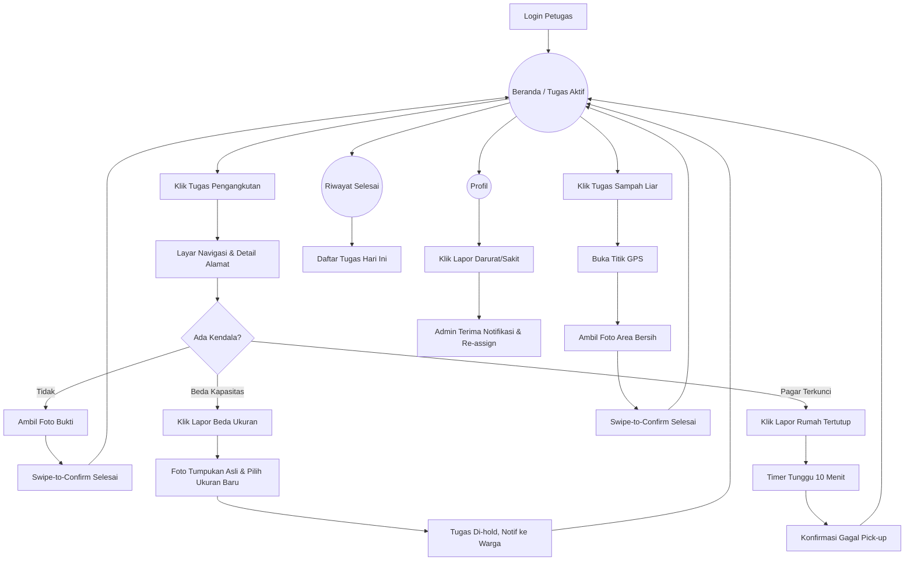

# UI/UX Brief & Konteks: Role Petugas EcoTrash

Dokumen ini memuat panduan, konteks, dan struktur informasi untuk merancang antarmuka (UI) dan pengalaman pengguna (UX) khusus bagi **Role Petugas** pada aplikasi web EcoTrash. Brief ini disusun berdasarkan Product Requirement Document (PRD) EcoTrash.

## 1. Ikhtisar Peran Petugas
Petugas adalah ujung tombak eksekutor di lapangan. Mereka bertugas menjemput sampah harian rumah tangga warga serta membersihkan titik-titik tumpukan sampah liar berdasarkan instruksi/penugasan dari Admin. 

**Tujuan UX Petugas:**
- **Mobile-First Mutlak:** Petugas mengakses aplikasi di jalan, di atas kendaraan, atau saat bekerja fisik (memakai sarung tangan). Antarmuka harus sangat mudah disentuh (*Big Buttons*), minim mengetik (*Low Typing*), dan memiliki kontras warna tinggi agar tetap terbaca di bawah sinar matahari langsung (*Outdoor Visibility*).
- **Berorientasi pada Tugas (Task-Driven):** Fokus aplikasi murni pada efisiensi penyelesaian *to-do list* harian. Petugas tidak butuh grafik atau fitur sosial, melainkan kejelasan "Ke mana saya harus pergi selanjutnya?".
- **Keamanan Bukti Digital:** Proses pemotretan sebagai bukti penyelesaian tugas (atau bukti masalah) harus cepat dan langsung tersimpan dengan koordinat lokasi (*geotagging*).

---

## 2. Struktur Menu (Information Architecture)

Karena fokus pada efisiensi lapangan, navigasi Petugas disarankan menggunakan **Bottom Navigation Bar** yang sangat sederhana (idealnya hanya 2-3 tab):

### A. Beranda (Tugas Aktif)
- **Header:** Nama Petugas dan *Toggle* Status Kehadiran (Aktif / Lapor Berhalangan).
- **Peta Rute Mini:** *Widget* peta (opsional) yang menunjukkan titik-titik pengambilan di komplek yang ditugaskan hari ini.
- **Daftar Tugas Harian:** *List* tugas (Pesanan Pengangkutan & Laporan Liar) yang diurutkan berdasarkan status atau kedekatan rute.

### B. Riwayat (Tugas Selesai)
- Daftar riwayat tugas yang sudah diselesaikan atau dibatalkan khusus untuk **hari ini** dan beberapa hari terakhir (untuk pencatatan mandiri petugas).

### C. Profil
- Informasi dasar: Nama, Email, Area/Komplek Penugasan saat ini.
- Tombol *Log Out*.

---

## 3. Alur Kerja Utama & Interaksi Spesifik

Berdasarkan PRD, berikut adalah alur interaksi kritis yang akan dilakukan oleh Petugas di lapangan:

### 3.1 Proses Pengangkutan Sampah Normal
1. **Terima Tugas:** Petugas membuka daftar tugas harian. Klik salah satu kartu pesanan warga.
2. **Navigasi & Eksekusi:** Layar detail menampilkan Alamat (Blok/No Rumah) dan Catatan Warga. Petugas memencet tombol (atau *slider* untuk mencegah salah pencet) "Mulai Proses".
3. **Bukti Foto:** Setelah sampai dan mengambil sampah, petugas menekan tombol kamera besar untuk memotret lokasi/sampah.
4. **Selesai:** Menekan tombol konfirmasi penyelesaian. Status berubah, koin otomatis terkirim ke warga, dan kartu tugas hilang dari antrean aktif.

### 3.2 Penanganan Kasus Khusus (Edge Cases Lapangan)
Aplikasi Petugas adalah tempat paling banyak menampung tombol "Intervensi Kendala".

- **Kendala Beda Kapasitas:** Jika warga memesan ukuran "Kecil" tapi aktualnya "Besar", petugas menekan tombol **"Lapor Beda Ukuran"**. Petugas memotret tumpukan asli, lalu sistem otomatis "membekukan" (*hold*) tugas tersebut sambil mengirim notifikasi konfirmasi perubahan harga ke warga.
- **Kendala Lokasi Tertutup (Gagal Pick-up):** Jika rumah/pagar terkunci, petugas menekan tombol **"Lapor Rumah Tertutup"**. Aplikasi bisa menampilkan *Timer Count-down* 10 Menit. Setelah 10 menit tanpa respons warga, petugas diizinkan menekan tombol "Batalkan Tugas - Gagal Pick-up".
- **Petugas Berhalangan Darurat:** Terdapat fitur darurat (misal di halaman Profil) **"Lapor Kendala Kendaraan / Sakit"**. Jika ditekan, admin akan langsung mendapat alarm notifikasi untuk memindahkan sisa tugas ke petugas lain.

### 3.3 Penanganan Laporan Sampah Liar
Sama dengan alur pesanan normal, namun panduan lokasinya mengandalkan *Pinpoint Maps* (titik GPS), bukan teks nomor blok rumah. Petugas menuju titik GPS, membersihkan area, memotret area yang sudah bersih, dan menyelesaikannya.

---

## 4. Arahan Desain Visual (UI Guidelines)

- **Layout "Fat Finger Friendly":** Semua *card* tugas, *dropdown*, dan terutama tombol eksekusi ("Selesai", "Foto") harus ekstra besar. Hindari penggunaan teks kecil.
- **Gestur Swipe/Slider:** Untuk menghindari tombol tertekan secara tidak sengaja di dalam saku, aksi kritis seperti "Tandai Selesai" disarankan menggunakan pola UX *Swipe to Confirm* (geser untuk konfirmasi) ketimbang tombol tap biasa.
- **Warna Tema (Selaras dengan Admin & Warga):**
  - Mengikuti *UI Guideline* utama aplikasi EcoTrash, namun dengan pengaturan **kontras tinggi** (High Contrast) agar terbaca jelas di luar ruangan (*outdoor*).
  - **Primer:** Hijau Daun (Emerald/Forest Green) untuk elemen dan tombol aksi utama.
  - **Latar Belakang:** Putih murni atau Abu-abu Muda (Light Gray) agar teks sangat jelas terbaca.
  - **Aksen Status/Kendala:** Kuning mencolok untuk tugas yang di-*hold* (menunggu konfirmasi warga), Hijau Terang untuk tugas yang telah selesai, dan Merah menyala untuk peringatan atau tombol pelaporan darurat.

---

## 5. Flowchart Alur Screen Role Petugas

Diagram di bawah ini menggambarkan alur penyelesaian tugas yang sangat linear (*task-driven*) bagi Petugas lapangan.



---

## 6. Gambaran Screen (ASCII) & Struktur Data

Berikut adalah gambaran antarmuka ASCII. Sesuai pedoman, layar ini didominasi oleh tombol berukuran super besar dan label yang tebal (High Contrast).

### A. Layar Beranda (Tugas Aktif)

**Gambaran ASCII:**
```text
+-----------------------+
| 👤 Asep S.     [ 🟢 ] |
| (Toggle: Aktif/Sakit) |
|-----------------------|
| DAFTAR TUGAS HARI INI |
|-----------------------|
| 🚛 PENGANGKUTAN       |
| Komplek Bunga Asri    |
| Blok C/12 (Besar)     |
|                       |
| [ >>> MULAI JALAN ]   |
|-----------------------|
| 📸 SAMPAH LIAR        |
| Jl. Utama Taman       |
|                       |
| [ >>> MULAI JALAN ]   |
|                       |
|-----------------------|
| 📋 Aktif | ✅ Riwayat | 👤 |
+-----------------------+
```

**Struktur Data (DataGrid/List Tugas):**
- `status_petugas` (Boolean: Aktif / Berhalangan)
- Array Tugas Harian:
  - `id_tugas` (String)
  - `jenis_tugas` (Enum: Angkut, Liar)
  - `alamat_atau_titik` (String / Koordinat)
  - `kategori_sampah` (String)
  - `status_tugas` (Enum: Dalam Antrean, Menuju Lokasi)

### B. Layar Eksekusi Tugas (Angkut / Liar)

Layar ini terbuka saat petugas menekan tombol "Mulai Jalan" pada layar Beranda. 

**Gambaran ASCII:**
```text
+-----------------------+
| < Kembali             |
|-----------------------|
| 📍 Blok C/12          |
|    Komplek Bunga Asri |
|                       |
| 📝 "Tolong sekalian   |
|    yang di ember ya"  |
|                       |
| +-------------------+ |
| |        📸         | |
| | AMBIL FOTO BUKTI  | |
| +-------------------+ |
|                       |
| --- Lapor Kendala --- |
| [ ⚠️ Beda Ukuran ]    |
| [ 🔒 Pagar Tertutup ] |
|                       |
|=======================|
| >>>> GESER SELESAI >> |
|=======================|
+-----------------------+
```

**Struktur Data:**
- `id_resi` / `id_laporan` (String)
- `alamat_lengkap` (String)
- `catatan_warga` (String)
- `foto_bukti_base64` (String - diset setelah klik tombol kamera)
- **Aksi Khusus:** `Swipe` (merubah status jadi Selesai di DB). Tombol Kendala memicu modal darurat.

### C. Modal / Layar: Lapor Beda Ukuran (Edge Case)

Jika di lapangan petugas menemukan sampah berukuran besar padahal pesanan warga adalah kecil.

**Gambaran ASCII:**
```text
+-----------------------+
| [X] Tutup             |
|-----------------------|
| LAPOR KAPASITAS BEDA  |
|                       |
| 1. Foto Tumpukan Asli |
|  +-----------------+  |
|  |     [ 📸 ]      |  |
|  |   AMBIL FOTO    |  |
|  +-----------------+  |
|                       |
| 2. Pilih Ukuran Asli: |
|  [ KECIL ] (Pesanan)  |
|  [ SEDANG ]           |
|  [ BESAR ] <--- Pilih |
|                       |
| [ KIRIM KE WARGA ]    |
+-----------------------+
```

**Struktur Data Form Konfirmasi:**
- `foto_tumpukan_aktual` (String Base64)
- `ukuran_aktual` (Enum: Sedang, Besar)
- *Aksi ini akan menahan (hold) status tugas dan memicu notifikasi ke perangkat Warga.*

### D. Layar Riwayat (Tugas Selesai)

**Gambaran ASCII:**
```text
+-----------------------+
| TUGAS SELESAI HARI INI|
|-----------------------|
| 12 Mei 2026           |
|                       |
| ✅ Blok C/12 (Besar)   |
|    Selesai: 09:15 WIB |
|-----------------------|
| ✅ Blok C/15 (Kecil)   |
|    Selesai: 09:30 WIB |
|-----------------------|
| ❌ Blok D/01           |
|    Gagal: Pagar Kunci |
|-----------------------|
| 📋 Aktif | ✅ Riwayat | 👤 |
+-----------------------+
```

**Struktur Data:**
- Array Riwayat Selesai (Difilter untuk hari ini/H-1 saja agar aplikasi tidak berat).
- `id_tugas`, `alamat_ringkas`, `status_akhir` (Selesai/Gagal), `waktu_penyelesaian` (Timestamp).

### E. Layar Profil & Darurat

**Gambaran ASCII:**
```text
+-----------------------+
| PROFIL PETUGAS        |
|-----------------------|
| [ Foto Profil ]       |
| Jajang Mulyana        |
| Area: Bunga Asri      |
|                       |
| --------------------- |
|  KEADAAN DARURAT      |
| +-------------------+ |
| |        🚨         | |
| | LAPOR BERHALANGAN | |
| |   (Motor Mogok /  | |
| |   Kecelakaan)     | |
| +-------------------+ |
| --------------------- |
|                       |
| [ KELUAR APLIKASI ]   |
|                       |
|-----------------------|
| 📋 Aktif | ✅ Riwayat | 👤 |
+-----------------------+
```

**Struktur Data:**
- `nama_petugas` (String)
- `area_penugasan_aktif` (String)
- **Aksi Darurat:** Memicu API POST `lapor_berhalangan` yang seketika mencabut seluruh sisa tugas harian dari akun Jajang dan membunyikan alarm di dasbor Admin.
