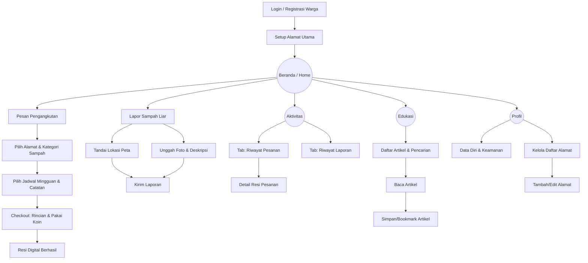

# UI/UX Brief & Konteks: Role Warga EcoTrash

Dokumen ini memuat panduan, konteks, dan struktur informasi untuk merancang antarmuka (UI) dan pengalaman pengguna (UX) khusus bagi **Role Warga** pada aplikasi web EcoTrash. Brief ini disusun berdasarkan Product Requirement Document (PRD) EcoTrash.

## 1. Ikhtisar Peran Warga
Warga adalah pengguna utama (End-User) sekaligus konsumen layanan dalam ekosistem EcoTrash. Mereka menggunakan aplikasi untuk menyelesaikan masalah sampah rumah tangga, menjaga kebersihan lingkungan sekitar melalui pelaporan, serta mendapatkan wawasan dari artikel edukasi. Warga sangat termotivasi oleh sistem penghargaan (*reward*) berupa koin yang bisa digunakan sebagai potongan harga.

**Tujuan UX Warga:**
- **Mobile-First & Intuitif:** Akses mayoritas dilakukan melalui *smartphone*. Antarmuka harus sangat ramah pengguna (terutama usia lanjut/ibu rumah tangga) dengan tombol yang besar dan alur yang jelas.
- **Transaksional yang Mulus (Seamless):** Proses pemesanan pengangkutan harus semudah memesan makanan di aplikasi ojek *online* (pilih alamat -> jadwal -> bayar/pakai koin -> resi).
- **Gamifikasi Ringan:** Penonjolan elemen Koin (animasi koin bertambah, visualisasi potongan harga) untuk mendorong partisipasi berkelanjutan (retensi).

---

## 2. Struktur Menu (Information Architecture)

Karena berfokus pada **Mobile-First**, navigasi utama Warga sangat disarankan menggunakan pola **Bottom Navigation Bar** untuk aksesibilitas jempol, dengan menu sebagai berikut:

### A. Beranda (Home / Dasbor Warga)
- **Header:** Sapaan nama pengguna, saldo Koin saat ini (bisa diklik untuk melihat riwayat).
- **Aksi Cepat (Quick Actions):** Tombol besar untuk 2 aksi utama: "Pesan Pengangkutan" dan "Lapor Sampah Liar".
- **Peta Interaktif (Live Map):** *Widget* peta (Leaflet.js) yang menampilkan titik TPS di area perumahan dan titik laporan sampah liar yang sedang ditangani.
- **Pesanan Aktif:** Kartu status (*tracker*) jika warga memiliki pesanan atau laporan yang sedang diproses.

### B. Aktivitas (Riwayat)
- **Tab Pesanan:** Daftar riwayat pemesanan pengangkutan (Menunggu, Diproses, Selesai, Dibatalkan). Klik untuk melihat detail & resi digital.
- **Tab Laporan:** Daftar riwayat pelaporan sampah liar beserta status verifikasinya (Menunggu, Disetujui, Ditolak).

### C. Edukasi
- **Daftar Artikel:** *Feed* artikel edukasi lingkungan (gambar *thumbnail*, judul, kategori).
- **Pencarian:** *Search bar* untuk mencari artikel berdasarkan kata kunci.
- **Artikel Tersimpan:** Halaman atau *tab* khusus berisi artikel yang telah ditandai/di-bookmark oleh warga.

### D. Profil
- **Data Diri:** Nama, Email/Kontak, Pengaturan *Password*.
- **Manajemen Alamat:** 
  - Tambah/Edit alamat rumah.
  - Form alamat berisi *Dropdown* pilihan "Nama Komplek" (bersumber dari Admin) dan *Input Text* untuk "Blok / Nomor Rumah" beserta alamat tambahan/sekunder.
- **Ketentuan & Bantuan:** Tautan kebijakan privasi atau kontak dukungan.

---

## 3. Alur Kerja Utama & Interaksi Spesifik

Berdasarkan PRD, berikut adalah alur fitur inti yang akan dilalui oleh Warga:

### 3.1 Pemesanan Pengangkutan
1. **Pilih Alamat & Kategori:** Warga memilih alamat yang sudah disimpan, lalu memilih estimasi ukuran sampah (Kecil, Sedang, Besar) yang akan memengaruhi harga dasar.
2. **Pilih Jadwal:** Memilih hari ketersediaan (diatur admin) dan memasukkan catatan opsional untuk petugas.
3. **Pembayaran & Koin:** Halaman *Checkout* (Rincian Biaya). Warga bisa memasukkan koin (maksimal 50% potongan tagihan). 
4. **Resi Digital:** Sistem mengeluarkan resi tanpa *payment gateway* sungguhan (Simulasi Lunas).

### 3.2 Pelaporan Sampah Liar
1. **Titik Lokasi:** Antarmuka *Map* (Peta) layar penuh untuk *pinpoint* lokasi sampah secara akurat.
2. **Unggah Bukti:** Fitur kamera atau unggah galeri.
3. **Deskripsi:** Kolom teks penjelasan.

### 3.3 Penanganan Kasus Khusus (Edge Cases)
- **Batal Pesanan:** Warga harus bisa membatalkan pesanan (tombol "Batalkan") maksimal 1 jam sebelum jadwal. Koin harus terlihat kembali ke saldo.
- **Konfirmasi Beda Kapasitas:** Jika warga memesan ukuran "Kecil", tetapi di lapangan petugas menemukan ukuran "Besar", warga akan menerima Notifikasi (dan *Pop-up* darurat di aplikasi). Warga harus mengklik "Setuju Penyesuaian Biaya" atau "Tolak & Batalkan".
- **Laporan Ganda:** Jika Warga melaporkan sampah yang sudah dilaporkan orang lain (tergabung oleh Admin), warga mendapat notifikasi bahwa laporan diterima namun koin *reward* tidak diberikan karena duplikasi.

---

## 4. Arahan Desain Visual (UI Guidelines)

- **Layout Mobile-First:** Fokus pada ruang sentuh (Touch Target) minimal 44x44 pixel. Form input besar dan mudah diketik.
- **Warna Tema:** 
  - *Primary:* Hijau Daun (Ramah lingkungan).
  - *Secondary/Coin:* Emas/Kuning terang untuk elemen koin agar *standout* dan memicu kepuasan psikologis.
- **Notifikasi Waktu Nyata:** Penggunaan sistem *Snackbar* atau *Toast* di bagian atas layar untuk memberi tahu warga bahwa "Petugas sedang menuju lokasi Anda" atau "Laporan Anda telah disetujui, +10 Koin!".
- **Resi Digital:** Desain resi pesanan harus dibuat menyerupai struk fisik atau *boarding pass* digital yang cantik, lengkap dengan kode TRX, untuk memberikan kesan premium dan kredibel.

---

## 5. Flowchart Alur Screen Role Warga

Diagram di bawah ini menggambarkan alur navigasi (*Screen Flow*) yang bisa diakses oleh Warga melalui aplikasi.



---

## 6. Gambaran Screen (ASCII) & Struktur Data

Berikut adalah gambaran kasar tata letak (*wireframe*) menggunakan teks ASCII yang disimulasikan dalam layar *Smartphone*.

### A. Layar Beranda (Dasbor)

**Gambaran ASCII:**
```text
+-----------------------+
| 👤 Hai, Budi S!   [🔔]|
| 🪙 Saldo Koin: 450   |
|-----------------------|
|  Mau apa hari ini?    |
| +-------------------+ |
| | 🚛 Pesan Angkut  | |
| +-------------------+ |
| +-------------------+ |
| | 📸 Lapor Sampah  | |
| +-------------------+ |
|                       |
|   [Peta Mini TPS/     |
|    Laporan Liar]      |
|                       |
|-----------------------|
| 🏠 | 📋 | 📚 | 👤 |
+-----------------------+
(Nav: Beranda|Aktivitas|Edukasi|Profil)
```

**Struktur Data:**
- `nama_pengguna` (String)
- `saldo_koin` (Integer)
- `notifikasi_belum_dibaca` (Boolean)
- `titik_peta` (Array Objek: `lat`, `lng`, `tipe_marker`)

### B. Layar Pemesanan (Alur Bertahap / Wizard)

**Gambaran ASCII (Tahap Jadwal & Checkout):**
```text
+-----------------------+
| <   Rincian Pesanan   |
|-----------------------|
| 📍 Komplek Bunga Asri |
| 📦 Kategori: Besar    |
|                       |
| Periode Pesanan:      |
| 11 Mei - 17 Mei 2026  |
|                       |
| Pilih Jadwal (Minggu Ini):
| [Sen] [Sel] [Kam] [Jum]|
|  11    12    14    15  |
|                       |
| Tagihan      Rp35.000 |
| [x] Pakai Koin (Max)  |
|     -100 Koin(-10.000)|
|-----------------------|
| TOTAL BAYAR  Rp25.000 |
|                       |
|  [ KONFIRMASI PESAN ] |
+-----------------------+
```

**Struktur Data Form Pemesanan:**
- `id_komplek` (String/ID dari DB)
- `detail_blok_rumah` (String)
- `kategori_sampah` (Enum: Kecil, Sedang, Besar)
- `periode_pesanan_label` (String) - *Dihasilkan secara dinamis berdasarkan minggu berjalan (misal: "11 Mei - 17 Mei 2026").*
- `tanggal_penjemputan` (Date)
- `nama_hari_penjemputan` (String) - *Misal: "Senin", "Selasa".*
- `catatan_petugas` (String - Opsional)
- `koin_digunakan` (Integer)
- `total_harga_akhir` (Integer)

### C. Layar Pelaporan Sampah Liar

**Gambaran ASCII:**
```text
+-----------------------+
| <   Lapor Sampah Liar |
|-----------------------|
| 📍 Tentukan Titik:    |
|   [ Peta Interaktif ] |
|   [📍 Gunakan Lokasi] |
|                       |
| 📸 Foto Bukti:        |
|  +-----+              |
|  | [O] | Ambil Foto   |
|  +-----+              |
|                       |
| 📝 Keterangan:        |
| [ Ketik deskripsi...] |
|                       |
|   [ KIRIM LAPORAN ]   |
+-----------------------+
```

**Struktur Data Form Laporan:**
- `koordinat_lokasi` (Objek: `lat`, `lng`)
- `foto_base64_atau_url` (String)
- `deskripsi_laporan` (String)

### D. Layar Aktivitas (Riwayat)

**Gambaran ASCII:**
```text
+-----------------------+
|       Aktivitas       |
| [Pesanan] [Laporan]   |
|-----------------------|
| Selasa, 12 Mei 2026   |
| Kategori: Besar       |
| Status: ✅ Selesai     |
| Biaya: Rp 25.000      |
| [ Lihat Resi Digital ]|
|-----------------------|
| Jumat, 08 Mei 2026    |
| Kategori: Kecil       |
| Status: ⏳ Menunggu   |
| [   Batalkan Pesanan ]|
|-----------------------|
|                       |
|-----------------------|
| 🏠 | 📋 | 📚 | 👤 |
+-----------------------+
```

**Struktur Data Riwayat (List):**
- Array objek dari tabel `Pesanan` milik *user_id* ini:
  - `id_resi` (String)
  - `tanggal` (Date)
  - `nama_hari` (String)
  - `kategori` (String)
  - `status` (Enum)
  - `total_bayar` (Integer)
- **Aksi:** Detail Resi (Read-Only), Pembatalan Pesanan (Aksi POST dengan validasi waktu).

### E. Layar Edukasi

**Gambaran ASCII:**
```text
+-----------------------+
| Edukasi Lingkungan    |
| [🔍 Cari Artikel...]  |
|-----------------------|
| [ IMG THUMBNAIL ]     |
| Cara Daur Ulang Plast |
| Kategori: Panduan     |
| [⭐ Simpan Artikel ]   |
|-----------------------|
| [ IMG THUMBNAIL ]     |
| Bahaya Baterai Bekas  |
| Kategori: Info        |
| [⭐ Simpan Artikel ]   |
|-----------------------|
| 🏠 | 📋 | 📚 | 👤 |
+-----------------------+
```

**Struktur Data Edukasi:**
- `kata_kunci_pencarian` (String)
- Daftar Artikel: 
  - `id_artikel` (String)
  - `judul` (String)
  - `kategori` (String)
  - `gambar_thumbnail` (URL String)
  - `status_bookmark` (Boolean - *toggle* untuk menyimpan artikel di tab tersimpan).

### F. Layar Profil

**Gambaran ASCII Profil:**
```text
+-----------------------+
| Profil Warga          |
|-----------------------|
| [Foto/Inisial]        |
| Budi Santoso          |
| budi@email.com        |
|                       |
| > Kelola Alamat       |
| > Daftar Artikel Save |
| > Ubah Password       |
| > Bantuan & Aturan    |
|                       |
|      [ Keluar ]       |
|-----------------------|
| 🏠 | 📋 | 📚 | 👤 |
+-----------------------+
```

**Struktur Data Manajemen Profil & Alamat:**
- Data Utama: 
  - `nama` (String)
  - `email` (String)
  - `password_hash` (Hidden/System)
- Array Daftar Alamat: 
  - `id_alamat` (String)
  - `id_komplek` (Relasi dari Master Komplek)
  - `nama_komplek` (String)
  - `blok_nomor_rumah` (String)
  - `is_utama` (Boolean)
